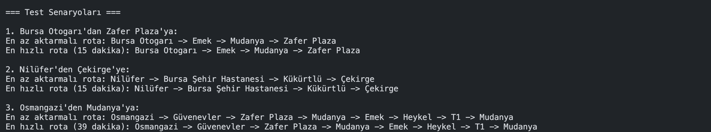

 
# Global AI Hub Akbank Python ile Yapay Zekaya Giriş Bootcamp
---

## Sürücüsüz Metro Simülasyonu (Rota Optimizasyonu) Projesi

Bu proje Glabol AI Hub kapsamında düzenlenen Akbank Python ile Yapay Zekaya Giriş Bootcamp'i bitirme projesidir. 

Bu projede metro istasyonları üzerinden seçilen duraklar arasından ___BFS (Breadth-First Search)___ ve ___A* (A-Star Search)___ algoritmaları kullanılarak en az aktarmalı yol ve en hızlı rota tespiti yapılmıştır.

---

## Kullanılan Teknolojiler ve Kütüphaneler

### collections Kütüphanesi 
Python'un collections modülü, standart veri yapılarını daha güçlü ve esnek hale getiren özel konteyner veri tipleri sunar. Bu modül, özellikle büyük veri setleri ve karmaşık veri yapılarını yönetmek için oldukça kullanışlıdır.

collections kütüphanesindeki başlıca veri yapıları

* __namedtuple()__
* __deque__
* __ChainMap__
* __Counter__
* __OrderedDict__
* __defaultdict__
* __UserDict__
* __UserList__
* __UserString__

Eğer bu veri yapıları hakkında detaylı bilgi istiyorsanız [buradan](https://docs.python.org/tr/3.13/library/collections.html) ulaşabilirsiniz. 
Projede kullandığımız __deque__ veri yapısına bir bakalım.

#### deque

Stack ve Queue’nin genelleştirilmiş hali diyebiliriz. “Double- ended queue” kısaltılmışı olarak Deque denmiştir ve Thread Safe desteği vardır. En son etkinliği izlemek için kullanışlıdır.

```python
from collections import deque

# deque oluşturma
dq = deque([1, 2, 3, 4])

# Sağdan eleman ekleme
dq.append(5)  # [1, 2, 3, 4, 5]

# Sondan eleman çıkarma
dq.pop()  # [1, 2, 3, 4]

# Soldan eleman ekleme
dq.appendleft(0)  # [0, 1, 2, 3, 4]

# Soldan eleman çıkarma
dq.popleft()  # [1, 2, 3, 4]

# Deque'nun uzunluğu
print(len(dq))  # 4
```

Hem append hem de appendleft işlemleri O(1) zaman karmaşıklığına sahiptir.
Hem baştan hem sondan eleman ekleyebilir veya çıkarabilirsiniz.
Eğer sırayla işlem yapıyorsanız, örneğin bir "queue" veya "stack" gibi, deque çok daha verimli olacaktır.

#### heapq 

heapq modülü, Python'da min heap (küçükten büyüğe sıralı öncelikli kuyruk) yapısını sağlamak için kullanılır. Bu modül, en küçük elemanı hızlı bir şekilde almak için optimize edilmiştir.

```python 
import heapq

# Listeyi heap'e çevirme
heap = [3, 1, 4, 1, 5, 9]
heapq.heapify(heap)  # Küçükten büyüğe bir min heap oluşturur
print(heap)  # [1, 1, 4, 3, 5, 9]

# En küçük elemanı ekleme ve çıkarma
heapq.heappush(heap, 2)
print(heap)  # [1, 1, 2, 3, 5, 9, 4]

# En küçük elemanı çıkarma
min_val = heapq.heappop(heap)
print(min_val)  # 1
print(heap)  # [1, 3, 2, 4, 5, 9]
```

Bir yığın kuyruğu (heap queue) veya öncelikli kuyruk (priority queue), en küçük (min-heap) veya en büyük (max-heap) öğeye hızlı bir şekilde erişmemizi sağlayan bir veri yapısıdır. Bir yığın genellikle ikili ağaç (binary tree) olarak uygulanır; burada her ebeveyn düğümün değeri, çocuklarından daha küçük (min-heap için) veya daha büyük (max-heap için) olur. Ancak, Python'da yığınlar genellikle min-heap olarak uygulanır, yani en küçük öğe her zaman ağacın kökünde bulunur ve bu da ona kolayca erişmeyi sağlar.

heapq modülü, bir listeyi yığın olarak ele almamıza olanak tanır ve öğe eklemek ve çıkarmak için verimli yöntemler sunar.


Heapq için daha detaylı bilgiye [buradan](https://docs.python.org/3/library/heapq.html) ulaşabilirsiniz. 

### Temel Veri Yapıları 

Projede yukarıda belirttiğim kütüphaneler ve modüller haricinde kullandığımız başka veri yapıları da mevcut. Bu veri yapılarına diğerlerinden daha sık kullandığımızı söyleyebilirim. 
Nedir bu veri yapıları?


<details>
<summary> Class (Sınıf) 📍</summary>

Python'da class (sınıf) yapısı, nesne yönelimli programlamanın temelidir. Sınıflar, bir nesnenin özelliklerini (attributes) ve davranışlarını (methods) tanımlayan bir şablon görevi görür. Örneğin, bir Araba sınıfı oluşturduğumuzda, bu sınıfın her arabaya özel marka, model, yıl gibi bilgileri saklamasını ve ilgili işlemleri yapmasını sağlayabiliriz.

Sınıf yapısını oluştururken genellikle `__init__()`adlı özel bir metot kullanırız. Bu metot, bir nesne oluşturulduğunda otomatik olarak çalışır ve nesnenin başlangıç değerlerini ayarlar. Metotlar ise sınıf içindeki fonksiyonlardır ve nesneye işlevsellik kazandırırlar. Aşağıda, temel bir Araba sınıfının nasıl oluşturulduğunu ve kullanıldığını gösteren bir örnek kod bulunmaktadır:

```python
class Araba:
    # Yapıcı Metot (Constructor) - Nesne oluşturulunca çalışır
    def __init__(self, marka, model, yil):
        self.marka = marka  # Arabanın markasını saklar
        self.model = model  # Arabanın modelini saklar
        self.yil = yil  # Arabanın üretim yılını saklar

    # Arabanın bilgilerini döndüren bir metot
    def bilgileri_goster(self):
        return f"{self.yil} model {self.marka} {self.model}"

# Sınıftan yeni bir nesne (araba) oluşturuyoruz
araba1 = Araba("Toyota", "Corolla", 2022)

# Arabanın bilgilerini ekrana yazdırıyoruz
print(araba1.bilgileri_goster())  # Çıktı: 2022 model Toyota Corolla
```
__Kod Açıklamaları:__
1. Sınıf Tanımlama (`class Araba:`)
   * Araba adlı bir sınıf oluşturduk. Bu sınıf, araba nesneleri oluşturmak için kullanılacak.

2. Yapıcı Metot (`__init__`)
   * `__init__()` metodu, nesne oluşturulunca otomatik olarak çalışır.
   `self.marka`, `self.model` ve `self.yil` değişkenleri, nesneye ait özellikleri saklar.

3. Metot (`bilgileri_goster`)
   * `bilgileri_goster()` adlı metot, arabanın marka, model ve yıl bilgilerini birleştirip ekrana yazdırmak için kullanılır.

4. Nesne Oluşturma (`araba1 = Araba(...)`)
   * araba1 adında bir nesne oluşturduk ve "Toyota", "Corolla", 2022" bilgilerini verdik.

5. Metot Çağırma (`print(araba1.bilgileri_goster())`)
   * `bilgileri_goster()` metodunu çağırarak, nesneye ait bilgileri ekrana yazdırdık.

</details>


<details>
<summary>Dictionary (Sözlük) 📍</summary>
Python programlama dilindeki sözlük veri tipi, gerçek hayatta ‘sözlük’ denince aklınıza gelen şeye çok benzer. Mesela gerçek hayatta ‘kitap’ kelimesinin İngilizce bir sözlükteki karşılığı book kelimesidir.
Dolayısıyla ‘kitap’ ve ‘book’ kelimeleri arasındaki ilişkiyi herhalde şu şekilde temsil edebiliriz:
`kitap: book`
Bu manzara bize ‘kitap’ kelimesinin karşılığının ‘book’ olduğunu açık bir şekilde gösteriyor. Eğer bu durumu Python’daki sözlük veri tipiyle göstermek isteseydik şöyle bir şey yazacaktık:

```
>>> kelimeler = {"kitap": "book"}
```
Esasında sözlük dediğimiz şey en basit haliyle şöyle görünür:

```
>>> sözlük = {}
```
Bu örnek boş bir sözlüktür. İsterseniz yukarıdaki veri tipinin gerçekten de bir sözlük olduğunu kanıtlayalım:
```
>>> type(sözlük)
<class 'dict'>
```
Python programlama dilinde doğru kod yazmak kadar okunaklı kod yazmak da çok önemlidir. Mesela bir sözlüğü şöyle tanımladığımızda kodlarımızın pek okunaklı olmayacağını söyleyebiliriz:

```python
sözlük = {"kitap": "book", "bilgisayar": "computer""programlama":"programming","dil": "language", "defter": "notebook"}
```

Teknik olarak baktığımızda bu kodlarda hiçbir problem yok. Ancak sözlükleri böyle sağa doğru uzayacak şekilde tanımladığımızda okunaklılığı azaltmış oluyoruz. Bu yüzden yukarıdaki sözlüğü şöyle yazmayı tercih edebiliriz:

```python

sözlük = {"kitap"      : "book",
          "bilgisayar" : "computer",
          "programlama": "programming",
          "dil"        : "language",
          "defter"     : "notebook" }
```

</details>

<details>

<summary>List (Liste) 📍</summary>

Giriş bölümünde de değindiğimiz gibi, listeler Python’daki veri tiplerinden biridir. Tıpkı karakter dizileri ve sayılar gibi

Herhangi bir öğeyi (tek, çift veya üç) tırnak içine aldığımızda karakter dizimizi tanımlamış oluyoruz. Liste tanımlamak için de buna benzer bir şey yapıyoruz. Dikkatlice bakın:

```python

>>> liste = ["öğe1", "öğe2", "öğe3"]
```
Gördüğünüz gibi, liste tanımlamak da son derece kolay. Bir liste elde etmek için, öğeleri birbirinden virgülle ayırıp, bunların hepsini köşeli parantezler içine alıyoruz.
Şimdi de oluşturduğumuz listenin tipini kontrol edelim :

```python
>>> liste = ["öğe1", "öğe2", "öğe3"]
>>> type(liste)
<class 'list'>
```


</details>


<details>
<summary> Tuple (Demet) 📍</summary>
Demetler, özellikle görünüş olarak listelere çok benzeyen bir veri tipidir. Bu veri tipi de, tıpkı listeler gibi, farklı veri tiplerini içinde barındıran kapsayıcı bir veri tipidir.

Demet tanımlamanın birkaç farklı yolu vardır. Nasıl karakter dizilerinin ayırt edici özelliği tırnak işaretleri, listelerin ayırt edici özelliği ise köşeli parantez işaretleri ise, demetlerin ayırt edici özelliği de normal parantez işaretleridir. Dolayısıyla bir demet tanımlamak için normal parantez işaretlerinden yararlanacağız:

```python

>>> demet = ("ahmet", "mehmet", 23, 45)
>>> type(demet)
<class 'tuple'>
```

Gördüğünüz gibi, parantez işaretlerini kullanmadan, öğeleri yalnızca virgül işareti ile ayırdığımızda da elde ettiğimiz şey bir demet oluyor.

Demet oluşturmak için tuple() adlı bir fonksiyondan da yararlanabilirsiniz. Bu fonksiyon, liste oluşturan list() fonksiyonuna çok benzer:

```python
>>> tuple('abcdefg')
('a', 'b', 'c', 'd', 'e', 'f', 'g')
```

</details>


<details>
<summary> Set (Küme) 📍</summary>
Set veri yapısı, Python'da tekrarsız ve sırasız öğelerden oluşan bir koleksiyondur. Set’teki her öğe yalnızca bir kez bulunabilir ve öğelerin sırası önemli değildir. Setler, kümelerle yapılan matematiksel işlemleri (birleşim, kesişim, fark) gerçekleştirmek için kullanılır. Set oluşturmak için {} küme parantezleri veya set() fonksiyonu kullanılır. Ayrıca, set'lerde eleman ekleme, eleman silme ve küme işlemleri yapılabilir.

```python
# Set Tanımlama (set() ile)
my_set = set([1, 2, 3, 4, 5])
print(my_set)  # {1, 2, 3, 4, 5}

# Eleman Ekleme
my_set.add(6)
print(my_set)  # {1, 2, 3, 4, 5, 6}

# Eleman Silme
my_set.remove(2)
print(my_set)  # {1, 3, 4, 5, 6}

# Küme İşlemleri
set1 = set([1, 2, 3])
set2 = set([3, 4, 5])

# Birleşim
print(set1.union(set2))  # {1, 2, 3, 4, 5}

```

</details>

<br>

Bunlar genelde python ile bir program yazarken sıklıkla kullandığımız temel veri yapılarından bazıları. Burda bu veri yapılarını özet olarak sadece nasıl işlevleri olduğunu kısaca göstermiş oldum. Yine bunlar hakkında daha detaylı bilgiye ulaşmak için __[buradan](https://docs.python.org/3/library/stdtypes.html)__ ulaşabilirsiniz. 

---
## Kullanılan Algoritmalar 

Verilne bu projede en kısa yol bulmaya bağlı olarak iki tane algoritma kullandık. Bunlar ___BFS (Breadth-First Search)___ ve ___A* (A-Star)___ algoritmaları. Bu algoritmaların ne olduğuna ve çalışma mantıklarına daha yakından bakalım. 

### 1. BFS (Breadth-First Search) Algoritması

BFS (Breadth-First Search), bir graf veya ağaç yapısında, başlangıç düğümünden başlayarak düğümleri katman katman keşfeden bir algoritmadır. BFS, her adımda ilk önce komşu düğümleri keşfeder ve sonra daha uzak olanlara geçer. Bu, düğümleri ziyaret ederken en kısa yolun bulunmasını sağlar, özellikle ağırlıksız ve yönsüz graflarda etkili olur.

#### BFS'nin Adımları:

__1. Başlangıç Düğümünü Kuyruğa Ekleme:__ İlk adımda, başlangıç düğümünü kuyruğa ekleriz.

__2. Kuyruktan Düğüm Çıkartma:__ Kuyruğun ilk elemanını çıkarırız ve bu elemanı ziyaret edilir olarak işaretleriz.

__3. Komşuları Kuyruğa Ekleme:__ Çıkarttığımız düğümün komşularını (bu düğüme doğrudan bağlı olan diğer düğümler) kontrol ederiz. Eğer komşu daha önce ziyaret edilmemişse, bu komşuyu kuyruğa ekleriz.

__4. Tekrarlama:__ Bu işlem, kuyruğa eklenen her düğüm için tekrarlanır. Kuyruk boşalana kadar devam ederiz.
   


#### BFS'nin Kullanım Alanları:

__1. En Kısa Yol Problemi:__ BFS, yönsüz veya ağırlıksız graf üzerinde en kısa yolu bulma problemi için idealdir. Çünkü BFS, ilk önce en yakın komşuları keşfettiği için en kısa yolu en hızlı şekilde bulur.

__2. Bağlantı Testi:__ BFS, bir grafın bağlantılı olup olmadığını test etmek için de kullanılabilir. Eğer başlangıç düğümünden tüm düğümlere ulaşılabiliyorsa, graf bağlantılıdır.

__3. Düzey Düzey Gezinme (Level-order Traversal):__ Ağaç yapılarında, düzey düzey gezinti yapmak için de BFS kullanılır. Ağaçta her seviyeyi sırayla ziyaret eder.

__4. Ağ (Network) Problemleri:__ Ağ yapılarında, düğümler arasındaki en kısa yolu bulmak veya ağdaki düğümlerin birbirine bağlı olup olmadığını anlamak için BFS uygulanabilir.

### 2. A* (A-Star) Algoritması 

A* (A Star) algoritması, iki nokta arasındaki en kısa yolu bulmak için kullanılan en etkili yol bulma algoritmalarından biridir. İlk olarak 1968 yılında Peter Hart, Nils Nilsson ve Bertram Raphael tarafından yayınlanan algoritma, başlangıçta Dijkstra’nın algoritmasına bir eklenti olarak ortaya çıkmış olsa da günümüzde en sık kullanılan yol bulma yöntemlerinden biri haline gelmiştir. Temelde, başlangıç ve bitiş düğümü arasındaki tüm düğümlerin konumlarına göre hesaplama yaparak en optimal sonuca ulaşır. BFS (Breadth-First Search) ve Dijkstra algoritmalarının birleşimi gibi çalışarak gereksiz düğümleri incelemekten kaçınır ve sezgisel fonksiyon (heuristic) kullanması sayesinde Dijkstra algoritmasına kıyasla daha hızlıdır.

A* algoritması yapı olarak muteber sezgisel (admissable heuristic) bir algoritma olarak sınıflandırılabilir. Bunun sebebi algoritmasının mesafe hesaplamada kullandığı fonksiyondur:

___f(n) = g(n) + h(n)___ denklemindeki

__f(n)__ = hesaplama yapan sezgisel (heuristic) fonksiyon.
__g(n)__ = Başlangıç düğümünden mevcut düğüme kadar gelmenin maliyeti
__h(n)__ = Mevcut düğümden hedef düğüme varmak için tahmin edilen mesafe.
Dikkat edileceği üzere _f(n)_ fonksiyonunun sezgisel olma sebebi, bu fonksiyon içerisinde bulunan ve tahmine dayalı olan _h(n)_ sezgisel fonksiyonudur.

__Sezgisel Fonksiyon (Heuristic) Seçimi__

A* algoritmasının başarısı, h(n) fonksiyonuna bağlıdır. Yaygın olarak kullanılan sezgisel fonksiyonlar:

1. Manhattan Mesafesi (Grid için iyi):
$$
h(n) = |x_1 - x_1| + |y_1 - y_2| + |z_1 - z_2|
$$

1. Öklid Mesafesi (Düzlemsel haritalarda iyi):

$$
h(n) = \sqrt{(x_1 - x_2)^2 + (y_1 - y_2)^2}
$$

3. Çizgisel Mesafe (Dijkstra’ya yakınlaştırır):

$$
h(n) = minimum kenar ağırlığı × mesafe
$$

#### Algoritmanın Çalışma Prensibi 

Algoritma yukarıdaki toplama işlemini kullanan oldukça basit bir yapıya sahiptir. Veri yapısı olarak bir öncelik sırası (priority queue) kullanan algoritmada en öncelikli olan düğüm f(n) değeri en düşük olan düğümdür.

1. Algoritma her adımda en düşük değeri (Ve dolayısıyla en önemli) düğümü alır (yani bu düğüme gider) ve düğümü sıradan (queue) çıkarır.
2. Gidilen bu düğüme göre komşu olan bütün düğümlerin değerleri güncellenir (artık bu düğüme gelmenin bir maliyeti vardır ve dikkat edilirse f(n) fonksiyonu içerisinde bu değer yer almaktadır.)
3. Algoritma yukarıdaki adımları hedefe varana kadar (yani hedef düğümü öncelik sırasında (priority queue) en öne gelene kadar) veya sırada (queue) düğüm kalmayana kadar tekrarlar.


### Neden Bu Algoritmalar Kullanıldı 

BFS (Breadth-First Search) ve A* (A Star) algoritmaları, yol bulma ve graf arama problemlerinde sıkça kullanılan yöntemlerdir. BFS, en kısa yolu bulmak için düğümleri katman katman tarayan eksiksiz (complete) ve optimal bir algoritmadır, ancak ağırlıklı graf yapılarında verimli değildir. A* algoritması ise, BFS ve Dijkstra’nın birleşimi gibi çalışarak gereksiz düğümleri incelemekten kaçınır ve heuristic (sezgisel fonksiyon) kullanarak en kısa yolu daha hızlı bulur. BFS, ağırlıksız graf yapılarında en kısa yolu garanti ederken, A ise ağırlıklı ve daha büyük ölçekli problemlerde daha verimli çalışır*. Bu nedenle, BFS daha temel ve kesin çözüm sunarken, A daha akıllı ve hızlı bir arama sağlar*.

<div style="display: flex;">
    <div style="margin-right: 10px;">
        
        <p> Şekil 1: BFS ile en kısa yolu bulma.</p>
    </div>
    <div>
        
        <p>Şekil 2: A-star ile en kısa yolu bulma.</p>
    </div>
</div>

---
## Örnek Kullanım ve Test Sonuçları 

```python
if __name__ == "__main__":
    metro = MetroAgi()
    
    # İstasyonlar ekleme
    # Yeşil Hat
    metro.istasyon_ekle("Y1", "Osmangazi", "Yeşil Hat")
    metro.istasyon_ekle("Y2", "Heykel", "Yeşil Hat")
    metro.istasyon_ekle("Y3", "T1", "Yeşil Hat")
    metro.istasyon_ekle("Y4", "Mudanya", "Yeşil Hat")
    
    # Mavi Hat
    metro.istasyon_ekle("M1", "Bursa Otogarı", "Mavi Hat")
    metro.istasyon_ekle("M2", "Emek", "Mavi Hat")  # Aktarma noktası
    metro.istasyon_ekle("M3", "Mudanya", "Mavi Hat")
    metro.istasyon_ekle("M4", "Zafer Plaza", "Mavi Hat")
    
    # Kırmızı Hat
    metro.istasyon_ekle("K1", "Nilüfer", "Kırmızı Hat")
    metro.istasyon_ekle("K2", "Bursa Şehir Hastanesi", "Kırmızı Hat")  # Aktarma noktası
    metro.istasyon_ekle("K3", "Kükürtlü", "Kırmızı Hat")
    metro.istasyon_ekle("K4", "Çekirge", "Kırmızı Hat")
    
    # Turuncu Hat
    metro.istasyon_ekle("T1", "Karacabey", "Turuncu Hat")
    metro.istasyon_ekle("T2", "Mustafakemalpaşa", "Turuncu Hat")
    metro.istasyon_ekle("T3", "Osmangazi", "Turuncu Hat")  # Aktarma noktası
    metro.istasyon_ekle("T4", "Güvenevler", "Turuncu Hat")
    
    # Bağlantılar ekleme
    # Yeşil Hat bağlantıları
    metro.baglanti_ekle("Y1", "Y2", 5)  # Osmangazi -> Heykel
    metro.baglanti_ekle("Y2", "Y3", 7)  # Heykel -> T1
    metro.baglanti_ekle("Y3", "Y4", 10)  # T1 -> Mudanya
    
    # Mavi Hat bağlantıları
    metro.baglanti_ekle("M1", "M2", 4)  # Bursa Otogarı -> Emek
    metro.baglanti_ekle("M2", "M3", 6)  # Emek -> Mudanya
    metro.baglanti_ekle("M3", "M4", 5)  # Mudanya -> Zafer Plaza
    
    # Kırmızı Hat bağlantıları
    metro.baglanti_ekle("K1", "K2", 6)  # Nilüfer -> Bursa Şehir Hastanesi
    metro.baglanti_ekle("K2", "K3", 5)  # Bursa Şehir Hastanesi -> Kükürtlü
    metro.baglanti_ekle("K3", "K4", 4)  # Kükürtlü -> Çekirge
    
    # Turuncu Hat bağlantıları
    metro.baglanti_ekle("T1", "T2", 12)  # Karacabey -> Mustafakemalpaşa
    metro.baglanti_ekle("T2", "T3", 7)  # Mustafakemalpaşa -> Osmangazi
    metro.baglanti_ekle("T3", "T4", 6)  # Osmangazi -> Güvenevler
    
    # Hat aktarma bağlantıları (aynı istasyon farklı hatlar)
    metro.baglanti_ekle("Y2", "M2", 3)  # Heykel aktarma
    metro.baglanti_ekle("K2", "T3", 4)  # Bursa Şehir Hastanesi aktarma
    metro.baglanti_ekle("M4", "T4", 2)  # Zafer Plaza aktarma

```
Örnek olarak Bursa şehrindeki metro itasyonları seçildi. İstasyonlar arasındaki bağlantılar yapıldı. Test sonuçlarını da görmüş olduk.



### Projeyi Geliştirme Fikirleri 

Projede algoritmaların daha verimli oldukları alanlara bağlı olarak farklı algoritmalar kullanılabilir. Sonuçlar karşılaştırılıp en iyi algoritma seçilebilir. 
Bu proje özelinde istasyonlardaki aktarmalar ve aktarma süreleri dikkate alınarak en iyi rotalar ve en kısa süre hesaplaması iyileştirilebilir. 


